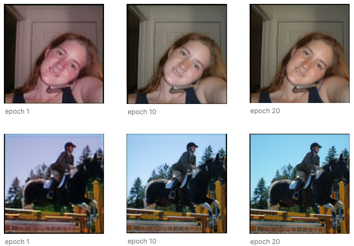

# SRGAN 구현하기

## 📌 논문
- Photo-realistic Single Image Super-Resolution Using a Generative Adversarial Network
- [논문 바로가기](https://arxiv.org/abs/1609.04802)

## 📌 SRGAN 특징
- GAN 모델을 기반으로 고해상도 이미지 생성. Generator는 고해상도 이미지를 생성하고, Discriminator는 해당 이미지가 실제 이미지인지 생성된 이미지인지 판별. 경쟁 구도를 통해 Generator가 정교하고 사실적인 고해상도 이미지를 생성할 수 있음
- Perceptual Loss: 생성된 이미지와 실제 이미지 간의 특징맵 차이 계산
    - $l_{V G G / i . j}^{S R}$: VGG 네트워크의 i 레이어의 j번째 특징 맵에 기반
    - $\phi_{i, j}$: VGG 네트워크의 i번째 레이어의 j번째 특징맵을 의미
    - $I^{HR}$: 실제 HR이미지를 의미
    - $G_{\theta_G}(I^{L R})$: LR이미지 $I^{LR}$을 입력받아 HR을 생성하는 함수

## 📌 모델 학습
- 학습데이터: [VOC2012](http://host.robots.ox.ac.uk/pascal/VOC/voc2012/#devkit)
- 모델링이 잘 되었는지 확인하는 용도이므로 Epoch 20회만 학습

